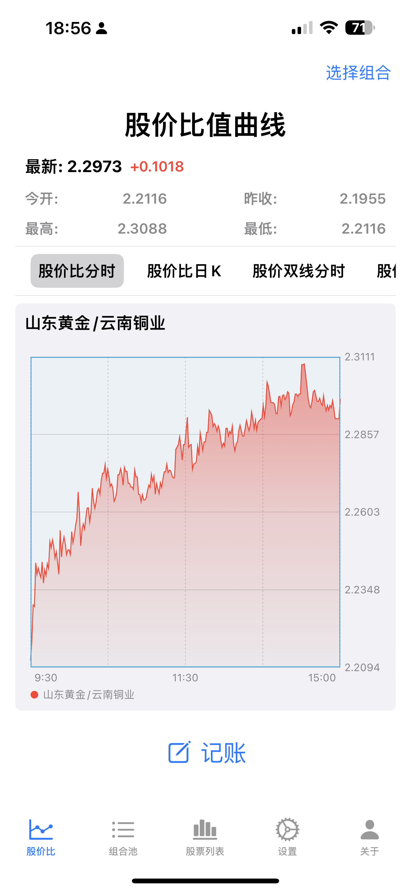

# 差价炒股技术支持
差价炒股技术支持

## 软件介绍

这是一个差价炒股辅助软件。

差价炒股利用两只不同股票的股价相互波动，来回倒仓获利的炒股手法。

该差价炒股软件可以实时展示股价的比值，分时和日K的股票价格比值或同时展示股价，还可以保存股票组合列表，记账等，轻松的利用差价炒股手法获利。

## 技术支持

如果有问题，联系开发者邮箱：

- z502545@icloud.com

- fuxing.zhang@qq.com

## 软件截图

<!--  -->